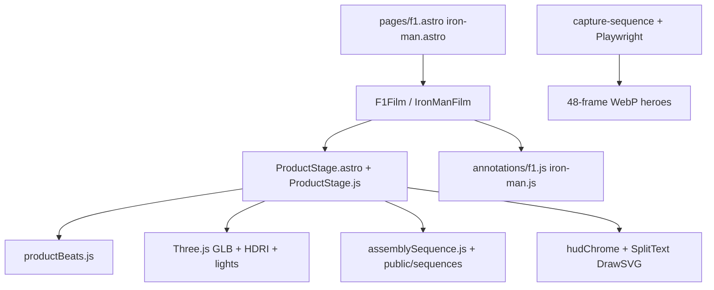

# Rebuild: F1-first + Iron Man

Source of truth for archiving product-films v1 and rebuilding competition-ready landings with Astro + GSAP (SVG/2D-first).

**Status:** **v3 hybrid shipped** at `/f1` and `/iron-man` (Garage3D + motion) · SVG-only v2 parked · ProductStage v1 at `/archive/*`  
**Handoff:** [`AGENTS.md`](../AGENTS.md) · [`journal.md`](../journal.md)  
**Learn lab:** `/learn` (unchanged)  
**Contest deadline:** Jul 31, 2026 (Webflow × GSAP × CodeTV)

---

## Part A — What we built (retrospective)

### Architecture that emerged



- **Shared film engine:** one `ProductStage` (~950 lines) driving camera look, explode parts, hotspots, DOF/bokeh, grade shader, theme lighting (F1 vs Iron Man).
- **Beat sequencing:** `productBeats.js` — height-weighted scroll → beat index; fixed the “1→8→1→2” jump by making scroll Y the single source of truth (not camera-distance matching).
- **Phase D hybrid:** pre-rendered 48-frame WebP assembly on hero (`public/sequences/`), then live WebGL for beats 1–8. Capture via Playwright (`scripts/capture-via-browser.mjs`).
- **HUD / GSAP chrome:** scramble telemetry, DrawSVG aero paths, speedo needle, counters — layered on top of 3D.
- **Lighting wars:** exposure/env/bgIntensity tuning; F1 car stayed dark while HDRI bg blew out; Iron Man hero too bright vs beats 1–8 OK → hero-only lighting profiles + re-capture.
- **Learn lab (keep):** `/learn` sessions 01–08 — Astro islands, Flip, set pieces, kitchen sink, GSDevTools. This is the toolkit for v2, not ProductStage.

### What worked (keep the ideas, not the monolith)

| Idea | Why it was good |
|------|-----------------|
| Scroll “beats” with one active part | Clear storytelling chapters |
| Authored camera looks / annotations | Director control vs free orbit |
| Assembly → inspect tour | Apple-style assemble fantasy |
| HUD telemetry / scramble / draw SVG | Competition “craft in 3 seconds” |
| Separate themes (F1 vs Iron Man) | Brand mood |
| Browser capture pipeline | Real frames when headless GL failed |

### What broke / why it felt unfixable

| Problem | Root cause |
|---------|------------|
| One god-file | ProductStage = loader + lights + explode + scroll + HUD + assembly + materials |
| Lighting never “done” | HDRI-as-background + ACES + metal materials fight each other |
| Sequence vs live mismatch | Baked frames ≠ live scene after theme tweaks |
| Mobile / load | Multi-MB GLB + HDRI + 48 WebPs before wow |
| Coupling | Changing F1 risked Iron Man |
| Competition fit | Multi-route lab, not one landing that “really lands” |

### What we learned (carry into v2)

1. **Astro** = HTML shell + client islands; heavy motion stays in `<script>`.
2. **ScrollTrigger** owns chapter progress; don’t invent competing beat detectors.
3. **GSAP set pieces** (Scramble, Morph, Flip, DrawSVG, MotionPath, Observer, GSDevTools) sell a landing faster than perfect PBR.
4. **Webflow’s timeline UI** ≠ GSDevTools; same idea → `gsap.timeline()` + labels in code.
5. **Archive > endless patch** when architecture debt > polish time.
6. **One story URL** for the contest; secondary models (W13, body) can wait / stay on archive stack.

---

## Part B — Archive standard

```text
src/archive/product-films-v1/   # ProductStage, F1Film, IronManFilm, shared libs used by v1
src/pages/archive/f1.astro      # /archive/f1
src/pages/archive/iron-man.astro
src/pages/f1.astro              # F1 v2 (reclaimed)
src/pages/iron-man.astro        # Iron Man v2 (reclaimed)
/learn/*                        # untouched
public/sequences/               # kept; optional later
```

Hub primary CTA → new `/f1`. Discreet “v1 archive” links. Git history remains; archive is for mental clarity.

---

## Part C — F1 v2 (“From grid to red line”)

### Thesis

One scroll story: AMR23 as a living telemetry film. Brand-first hero, then interactive sections. **No ProductStage dependency.**

### Sections

1. **Hero boot** — SplitText, ScrambleText, MorphSVG mark, timeline. No WebGL.
2. **Grid lights → GO** — staggered lights, scrub/hand-off into track.
3. **Racetrack** — SVG circuit, layered car + opponents, MotionPath + ScrollTrigger (scroll = throttle), DRS/limiter slider, racing-line DrawSVG, minimap, parallax stands.
4. **Aero** — DrawSVG streamlines, MorphSVG DRS wing, dirty-air particles near opponents.
5. **Garage Flip** — part chips → featured callouts (from old annotation copy).
6. **Telemetry** — deltas, ERS scrub, scramble pit wall; GSDevTools only in `import.meta.env.DEV`.
7. **Close** — lockup + CTA + links to archive + learn.

### Module layout

```text
src/components/f1-v2/
  F1Page.astro
  sections/HeroBoot.astro
  sections/GridLights.astro
  sections/Racetrack.astro + Racetrack.js
  sections/Aero.astro
  sections/GarageFlip.astro
  sections/Telemetry.astro
  sections/Close.astro
src/styles/f1-v2.css
```

### Success criteria

- First viewport wow without GLB
- Racetrack alive with scroll + slider
- Mobile-friendly (no HDRI required)
- `npm run build` green

---

## Part D — Iron Man v2 (“Mark 85: assemble under pressure”)

### Thesis

Suit as HUD + assembly narrative — not warehouse PBR wrestling.

### Sections

1. Hero: JARVIS scramble + MorphSVG arc reactor + SplitText MARK 85
2. Assembly rail: SVG parts via MotionPath (optional sequence later)
3. Systems tour: sticky chapters + DrawSVG schematics (annotation copy)
4. Power core: scroll scrub intensity + CustomWiggle
5. Flight path: MotionPath skyline / altitude tape
6. Close + archive link

Shared patterns with F1: section islands, one master scroll story, GSAP-first, 3D optional later.

### Module layout

```text
src/components/ironman-v2/
  IronManPage.astro
  sections/*.astro + flight/assembly JS as needed
src/styles/ironman-v2.css
```

---

## Part E — Implementation order

1. This document
2. Archive v1 + reclaim `/f1` / `/iron-man`
3. F1 sections: Hero → Grid → Track → Aero → Garage → Telemetry → Close
4. Polish + mobile
5. Iron Man v2 same pattern

## Out of scope (this pass)

- Fixing ProductStage lighting in place as primary product
- Re-capturing sequences as a blocker
- Webflow visual Interactions UI (code timelines only)

---

## Part F — V3 hybrid (shipped)

**Thesis:** GSAP sells the first viewport; pinned Three.js brings back the interesting 3D scrollytelling — without resurrecting the ProductStage monolith.

```text
/f1              → f1-v3 (GSAP sections + Garage3D)
/iron-man        → ironman-v3
/f1-v2           → parked SVG-only
/iron-man-v2     → parked SVG-only
/archive/*       → ProductStage v1
src/lib/garageStage/   → createGarageStage + pinned beatController (studio HDRI reflections, solid bg)
src/components/shared/Garage3D.astro
```

### F1 v3 flow

1. Hero / Grid / Racetrack / Aero (v2)
2. Flip parts board → `scrollTo` matching 3D beat
3. Pinned Garage3D (AMR23 GLB + annotation looks)
4. Telemetry / Close

### Iron Man v3 flow

1. JARVIS hero + SVG assembly teaser
2. Pinned Garage3D (Mark 85 GLB)
3. Systems / Power core / Flight coda
4. Close

### Lighting rule (v3)

Studio HDRI for **envMap only**; solid dark background — no skylit/warehouse plate competing with the model.

---

## Part G — Model motion (C+C)

**F1 garage model:** `/models/f1-amr23-parts.glb` (multi-mesh CC-BY F1 from GetGLB; see `public/models/ATTRIBUTION.md`). Wheel spin via `findWheels` heuristic (axle-span meshes). Procedural CFD-look airflow in `modelMotion.js` (`createAirflow`) scrubbed by `BEAT_FX`.

**Iron Man:** `/models/iron-man-rigged.glb` + `/models/mixamo-anims.glb`. Runtime retarget (`retargetMixamo.js`) maps standard Mixamo bones → Sketchfab `mixamorigHips_01` names. Beat clips: idle / look / repulse / thrust. Drop Mixamo **Without Skin** FBX into `public/models/_src/mixamo/` — see that README. Procedural palm pose only if no `repulse`/`agree` clip.

```text
src/lib/garageStage/modelMotion.js   # wheels, airflow, character, thrusters
src/lib/garageStage/themes.js        # BEAT_FX map
scripts/audit-glb.mjs                # npm run audit:glb -- path/to.glb
```

**Perf:** mobile particle caps; airflow/thrusters pause when garage pin is inactive (`onPinToggle`).

